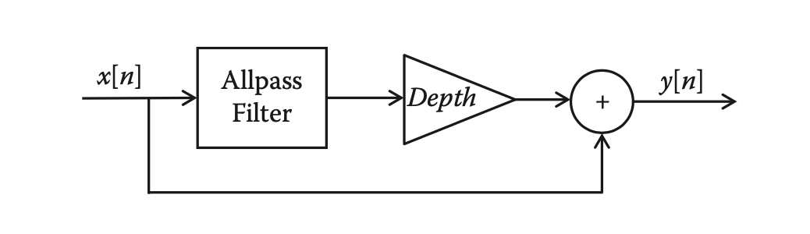

# Guitar Sound Effects

In this project, we implemented 4 commonly used sound guitar effects, `wah-wah` effect, `phaser` effect, `AM Tremolo` and `RM Tremolo`.

## Required environments
* pyaudio
* wave
* struct
* math
* numpy

## Wah-wah effect
The sound of the wah-wah effect resembles its name: wah-wah is a filter- based effect that imparts a speech-like quality to the input sound, similar to a voice saying the syllable “wah”. Wah-wah is most commonly known as a guitar effect that was popularized by Jimi Hendrix, Eric Clapton, and others in the late 1960s. However, its origins go back to the early days of jazz, when trumpet and trombone players achieved a similar sound using mutes. The wah-wah audio effect uses a band-pass or peaking filter whose cen- ter frequency is changed by a foot pedal.

### Implementation
Wah-wah effect requires a bandpass filter with a time varying centre (resonant) frequency and a small bandwidth. Filtered signal mixed with direct signal. Below is a figure of a general wah-wah effect block.

A wah-wah filter is a time-varying filter. Borrowed from analog eletronics, we can implement a `State Variable Filter` to realize independent control over the cut-off frequency and damping factor of a filter. In addition, the `State Variable Filter` can simultaneously get lowpass, bandpass and highpass filter output.

To implement the wah-wah efect, there are 3 important parts:
* A triangle wave to modulate the centre frequency of the bandpass filter;
* Implementation of state variable filter;
* Repeated recalculation if centre frequency within the state variable filter loop.

### The State Variable Filter Algorithm
Let $x(n)$ = input signal, $y_l(n)$ = lowpass signal, $y_b(n)$ = bandpass signal, $y_h(n)$ = highpass signal. 

The algorithm gives difference equations as follows:

$$
\begin{align}
y_l(n) &= F_1y_b(n)+y_l(n-1),\\
y_b(n) &= F_1y_h(n)+y_b(n-1),\\
y_h(n) &= x(n)-y_l(n-1)-Q_1y_b(n-1).
\end{align}
$$

with tuning coeffficients $F_1$ and $Q_1$ related to the cut-off frequency, $f_c$, and damping, $d$:

$$
\begin{align}
F_1 &= 2\sin(\pi f_c/f_s),\\
Q_1 &= 2d.
\end{align}
$$

## Phaser
The phase shifter (or phaser) creates a series of notches in the audio spectrum where sound at particular frequencies is attenuated or eliminated. The flanger also produces its characteristic sound from notches, and in fact, the flanger can be considered a special case of phasing. However, where the flanger is based on delays, the phaser uses allpass filters to create phase shifts in the input signal. When the allpass-filtered signal is mixed with the original, notches result from destructive interference. Where the flanger always generates evenly spaced notches, the phaser can be designed to arbitrarily control the location of each notch, as well as its number and width. As with the flanger, though, the phaser’s characteristic sound comes from the sweeping motion of the notches over time.

### Implementation
Phaser effect requires a notch filter, that can be realised as set of cascading IIR filters, also mixed with direct signal.

We could obatin a phaser effect by changing filter to a `notch` filter.
* A notch filter (or bandreject/bandstop filter) - attenuate frequencies in a narrow bandwidth (High Q factor) around cut-off frequency, $u_0$.

### The Phaser Filter Algorithm
The difference equation is given by:

$$
\begin{align}
y_1(n) &= -cx(n)+d(1-c)x(n-1)+x(n-2)-d(1-c)y_1(n-1)+cy_1(n-2),\\
y(n) &= \frac{1}{2}(x(n)\pm y_1(n)).
\end{align}
$$

where

$$
\begin{align}
d &= -\cos{(2\pi f_c/f_s)},\\
c &= \frac{\tan{(2\pi f_c/f_s)}-1}{\tan{(2\pi f_c/f_s)}+1}.
\end{align}
$$

* $+$ for bandreject
* $-$ for bandpass

## Tremolo
Tremolo is a musical term that literally means “trembling”. It typically refers to a style of playing involving fast repeated notes, for example, fast repeated bow strokes on a violin, rolls on a percussion instrument, or continuous rapid plucks on a mandolin. The tremolo audio effect simulates this play- ing style by periodically modulating the amplitude of the input signal, so a long sustained note comes out sounding like a series of short rapid notes. The effect is commonly used on electric guitar, and tremolo was built into some guitar amplifiers as early as the 1940s. Tremolo is also one of the more straightforward effects to implement digitally. 

We implement the Tremolo effect with 2 modulations: Amplitude Modulation and Ring Modulation.

## Amplitude Modulation Tremolo
Amplitude modulation specifically refers to one signal changing the amplitude (or gain) of another. There are two common uses of amplitude modulation in digital audio effects: tremolo and ring modulation. Though mathematically similar, their musical effects are quite different.

### Implementation
The idea of tremolo is simple can can be implemented by multiplying the inout signal $x(n)$ with a periodic, slowly varying signal $m(n)$:

$$
\begin{align}
    y(n) = m(n)x(n).
\end{align}
$$

The characteristic sound of the tremolo comes from the fact that the gain changes periodically over time. The modulating signal $m(n)$ is generated by a *low-frequency oscillator* (LFO):

$$
\begin{align}
    m(n) = 1+\alpha\cos{\omega_{\text{LFO}}},
\end{align}
$$

where $\alpha$ is the *depth* of the tremolo and $\omega_{\text{LFO}} = 2\pi f_{\text{LFO}}/f_s$ is the normalized frequency of the oscillator, where $f_s$ is the sampling frequency.

## Ring Modulation Tremolo
Ring modulation is an effect that multiplies the input signal by a periodic carrier signal, producing unusual, sometimes discordant sounds. Uniquely among common audio effects, the output sounds tend to be nonharmonic (not containing multiples of a fundamental frequency) for even the simplest of input sounds. Because of the strangeness of these nonharmonic outputs, the ring modulator is not widely used in music production.

### Implementation
The basic input/output relation of the ring modulator is identical to that of the tremolo,

$$
\begin{align}
    y(n) = m(n)x(n).
\end{align}
$$

The characteristic sound of the ring modulator results from the particular properties of the input and carrier signals.

Consider a simple case, where each of the signals is a single sinusoid,

$$
\begin{align}
    x(n) = \cos{(\omega n)}, m(n)=\cos{(\omega_c n)}.
\end{align}
$$

The cosine of the sum or difference of two angles may be given by $\cos{(A+B)} = \cos{(A)}\cos{(B)}-\sin{(A)}\sin{(B)}$ and $\cos{(A-B)} = \cos{(A)}\cos{(B)}+\sin{(A)}\sin{(B)}$. Therefore, 

$$
\begin{align}
    m(n)x(n) = \cos{(\omega n)}\cos{(\omega_c n)} = \frac{\cos{((\omega_c-\omega)n)} + \cos{((\omega_c+\omega)n)}}{2}.
\end{align}
$$

In our project, we ring modulate with a triangular wave.

## Note
This project consists of 2 folders. One is the
* `demo` folder and the other is the
* `real-time` folder. 

The sound effects are guitar effects, and work better for the real guitar or other musical instruments. In order to have a more intuitive feeling for these sound effects, we provide files in the *demo* folder. These files will read a wav file containing a guitar melody and apply these sound effects.

## Papers and Document

The above introduction to sound effects is based on the textbook [1] and PPT [2].

- [1] [Reiss, Joshua D., and Andrew McPherson. Audio effects: theory, implementation and application. CRC Press, 2014.](http://www.crcpress.com/product/isbn/9781466560284)

- [2] [10_CM0268_Audio_FX.pdf](https://users.cs.cf.ac.uk/Dave.Marshall/CM0268/PDF/10_CM0268_Audio_FX.pdf)
## Video
https://vimeo.com/user166163339

## Contributor

Shuanghong

Yiwen
